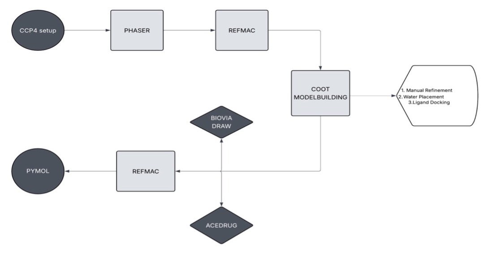
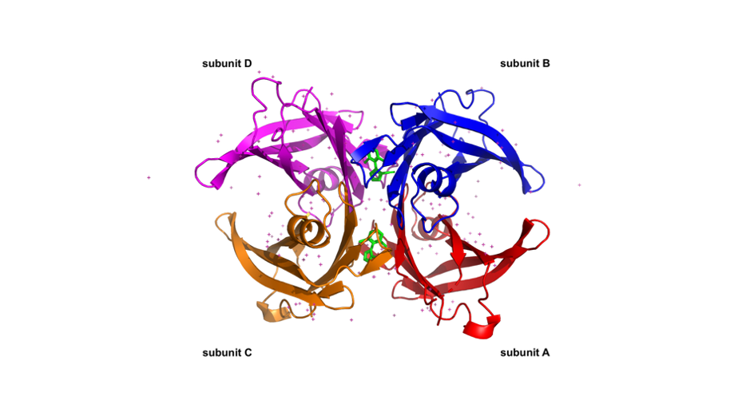

# TTR Structural Stabilization Analysis

# Overview
Transthyretin (TTR) amyloidosis is a protein misfolding disease caused by destabilization of the native tetramer into amyloidogenic monomers. Stabilizing the tetramer is a key therapeutic strategy.

This project explores the structural basis of TTR stabilization using X-ray crystallography and computational modeling.

##  Objective
To investigate how a chlorinated triazole ligand stabilizes the TTR tetramer and prevents dissociation.

##  Methods
- Molecular Replacement: **Phaser**
- Model Building: **Coot**
- Refinement: **REFMAC5**
- Visualization: **PyMOL**
- Software Suite: **CCP4**

## Workflow

##  Structure Visualization

> Visualization of transthyretin (TTR) tetramer highlighting the dimer–dimer interface and ligand-binding region.

##  Key Findings
- Ligand binds at the **dimer–dimer interface**
- Exhibits **pseudo-irreversible binding**
- Stabilizes tetrameric structure
- Prevents amyloid formation

##  Conclusion
This study demonstrates that divalent ligands can effectively stabilize TTR by locking the tetrameric structure, providing insights for rational drug design.

---

##  Skills Demonstrated
- Structural biology analysis
- Protein modeling and refinement
- Molecular visualization
- Use of CCP4 crystallography tools

## 📄 Full Report
Detailed report available here: [View Report](report.pdf)
